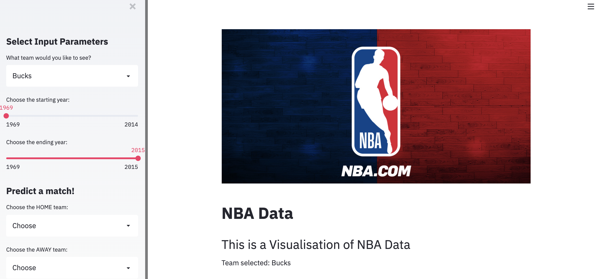
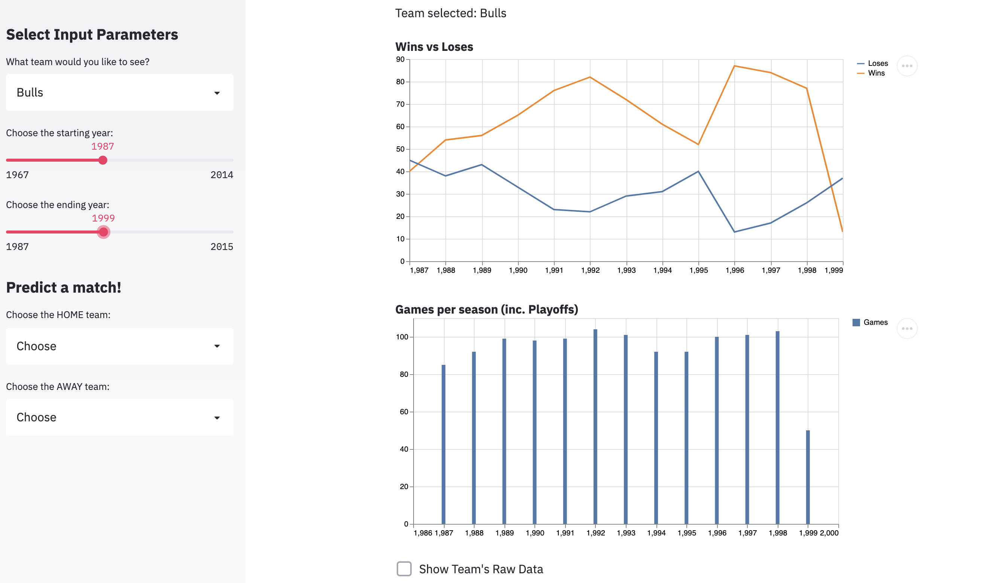
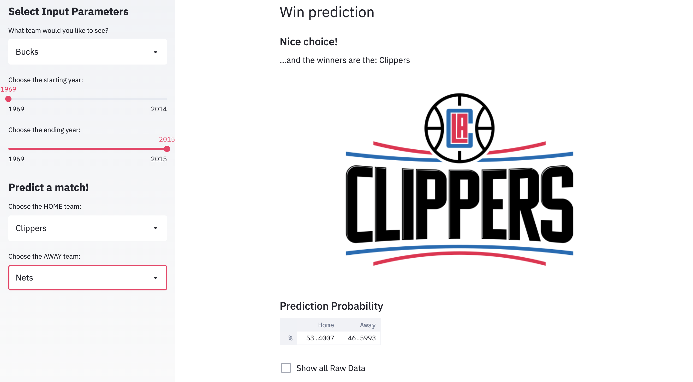

# Welcome to the NBA Prediction App 

  

## My app

Hello Basketball loving people!

This app is for those who are interested in my week of learning Python and Machine Learning.

I made this as a Student at Code Chrysalis during polyglotal week (week where we learn a new language from scratch)

---

#### This is what you see when you open the page:

---

#### You can select a team and start/end years to show data:

---

#### You can predict the winner of the game by selecting two teams (Home/Away)

---

### If you would like to use this app

**Here's how:**

* Fork and clone this repository
* Open this with your code editor of choice
* Activate your Python Environment (I used Anaconda), and make sure the libraries are installed properly on your chosen Environment

---

### My presentation slides

[>>> Click here to see the slides I used <<<](
https://docs.google.com/presentation/d/e/2PACX-1vRXO3l_9rm6H4n9lo0Q0UoBhfDC-RfQb0ASpoTT0CBJX51o9KW8aZwrquzvn2lq2eSWcKi-1Q-G6SjP/pub?start=false&loop=false&delayms=3000)

---

### Future improvements

* As this was my first time with Python, the Machine Learning predictability is not at a high accuracy percentage. I would like to increase this accuracy.
* Add more features and inputs so you can see all the data and it is very customizable
* Deploy this app. Potentially using a service such as Heroku

---

### Resourses and tutorials used

* Tutorial for Streamlit (https://www.youtube.com/watch?v=ZZ4B0QUHuNc)
* Pandas datasets for NBA data (https://realpython.com/pandas-python-explore-dataset/)
* Machine learning tutorial (https://www.youtube.com/watch?v=oLlN5SYZr5g)   (https://machinelearningmastery.com/make-predictions-scikit-learn/)   (https://scikit-learn.org/stable/modules/generated/sklearn.model_selection.train_test_split.html)   (https://www.youtube.com/watch?v=fwY9Qv96DJY)